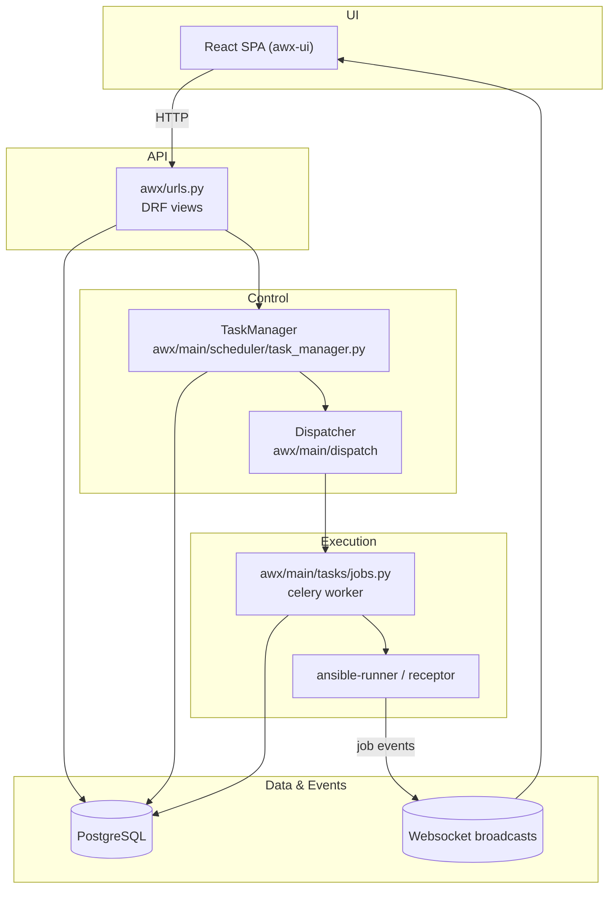
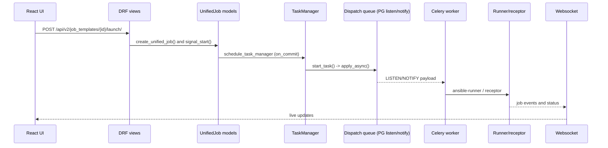

# AWX Architecture Map

This page orients new contributors to the control-plane flow and how the other deep-dive notes fit together. Use the diagrams as a road map, then jump into the linked files for code-level detail.

## How to use this guide

- Start with the flow diagram, then read `01-job-execution-overview.md`, `03-api-layer.md`, and `04-unified-jobs-model.md` in that order.
- When you need to find code quickly, use `rg` (examples in each deep dive) and search by class name.
- Keep the two planes straight: **control plane** (scheduler/dispatcher) and **execution plane** (runner/callbacks).

## High-level system map

### How to read the diagram

- **Boxes** represent concrete entry points in the repo (files or modules) instead of abstract components.
- **Arrows** are the primary runtime calls: HTTP into Django/DRF, scheduling through the task manager and dispatcher, job execution through celery workers and ansible-runner, and websocket notifications back to the UI.
- The **Data & Events** cluster shows which steps persist state or emit realtime updates.

## Flow-of-control drill-down

- **Launch** begins in `awx/api/views/__init__.py::JobTemplateLaunch.post` and immediately writes a `UnifiedJob` row.
- **Signal dispatch** happens via `awx/main/utils/common.py::schedule_task_manager`, which uses `connection.on_commit` so scheduling only fires after the DB write is durable.
- **Scheduling** logic in `task_manager.schedule()` assigns the job to an instance group/instance and publishes to the dispatcher queue.
- **Execution** is performed by celery workers in `awx/main/tasks/jobs.py`, which call ansible-runner or receptor and stream callback events.
- **Notifications** are emitted from `UnifiedJob.websocket_emit_status` and callback handlers so the UI updates without polling.

## Where to go next

- [Job execution overview](./01-job-execution-overview.md) — annotated path from user click to websocket updates.
- [Frontend launch flow](./02-frontend-launch.md) — how the React UI gathers prompts and issues the launch API requests.
- [API layer](./03-api-layer.md) — DRF view/serializer details for launches and prompts.
- [Unified jobs model](./04-unified-jobs-model.md) — persistence and status transitions.
- [Scheduler](./05-task-manager-scheduler.md) — task_manager internals and dependency handling.
- [Dispatcher](./06-dispatcher.md) — queue publication and worker consumption.
- [Job execution](./07-job-execution.md) — runner integration, callback pipeline, event storage.
- [Instances & capacity](./08-instances-and-capacity.md) — instance/instance-group capacity models used by the scheduler.
- [Storage schema](./09-storage-schema.md) — Postgres tables, key columns, and Redis usage.
- [Ansible terminology](./10-ansible-terminology.md) — core concepts (inventory, project, job) with a worked example.
