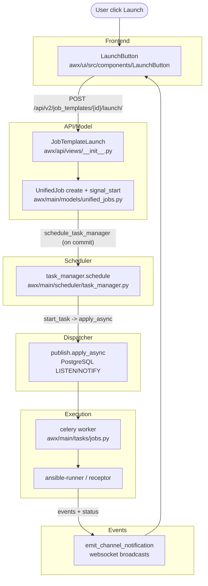

# Job Execution Overview

This document provides an end-to-end view of how a job executes in AWX, from the React launch button to websocket updates. Use it with the [architecture map](./00-architecture-index.md) to navigate the deeper drill-downs.

## What to take away

- Launch flows start in the UI, validate via API, then schedule via task manager.
- The dispatcher publishes to Postgres NOTIFY, and workers execute jobs.
- Websocket updates are a combination of stored events and live stream.

## Complete Flow Diagram



### Code checkpoints
- **Launch entrypoint**: `JobTemplateLaunch.post()` validates prompts and permissions before calling `create_unified_job()` and returning the new job identifier.
- **Durable scheduling**: `schedule_task_manager()` uses `connection.on_commit` so the scheduler only runs after the new job row is committed.
- **Placement**: `task_manager.schedule()` locks, gathers runnable jobs, assigns an instance group/instance, then publishes via `start_task()` and `publish.apply_async()`.
- **Execution**: celery workers execute `RunJob` (or receptor variants) from `awx/main/tasks/jobs.py`, writing events as ansible-runner streams callbacks.
- **Realtime updates**: `UnifiedJob.websocket_emit_status()` and callback handlers emit `jobs-status_changed` notifications so the UI updates without polling.

## Job Status Transitions

```
new → pending → waiting → running → successful
                    │         │          │
                    │         │          └→ failed
                    │         │          └→ error
                    │         └→ canceled
                    └→ canceled
```

| Status | Meaning |
|--------|---------|
| `new` | Job record created, not yet submitted for scheduling |
| `pending` | Job submitted to task manager, waiting to be scheduled |
| `waiting` | Job assigned to a node, waiting for worker to pick it up |
| `running` | Ansible playbook is executing |
| `successful` | Playbook completed successfully |
| `failed` | Playbook failed (Ansible returned non-zero) |
| `error` | AWX-level error (e.g., can't connect to node) |
| `canceled` | User or system canceled the job |

## Quick Troubleshooting Map

| Symptom | First Place to Check |
|---------|----------------------|
| `pending` forever | Task manager scheduling, instance group capacity |
| `waiting` forever | Dispatcher running, queue name, worker health |
| `running` but no output | Callback receiver and websocket connection |

## Detailed Component Documentation

- [Frontend Launch Flow](./02-frontend-launch.md)
- [API Layer](./03-api-layer.md)
- [Unified Jobs Model](./04-unified-jobs-model.md)
- [Task Manager & Scheduler](./05-task-manager-scheduler.md)
- [Dispatcher](./06-dispatcher.md)
- [Job Execution](./07-job-execution.md)
- [Instances & Capacity](./08-instances-and-capacity.md)
